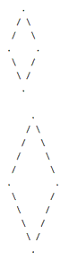

#Figuren zeichnen***

Es soll eine Klasse `DrawingFigures` geschrieben werden, die zwei Methoden zum Zeichnen von Quadraten und Rauten auf der 
Konsole anbietet. 

###Aufgaben
1. Implementiere in der Klasse `DrawingFigures` die Methode ` public void drawSquare(char sign, int numberOfSigns)`. Der Parameter 
`sign` gibt an, welches Zeichen zum Zeichnen des Quadrats verwendet werden soll, `numberOfSigns` die Anzahl an Zeichen einer Quadratkante.
2. Implementiere eine UI-Klasse, in der ein Quadrat beliebiger Größe gezeichnet wird.
3. Implementiere in der Klasse `DrawingFigures`die Methode `public void drawRhombus(int diameter)`. Sie zeichnet eine Raute mit dem 
entsprechenden Durchmesser. Der Durchmesser muss zwischen 5 und 50 liegen und ein ungerader Wert sein. 
4. Implementiere in der vorhandenen UI-Klasse die Möglichkeit, ieine Raute beliebiger Größe zu zeichnen.

**Beispiele:** 

für sign = '*' und numberOfSigns = 5
```
* * * * *
*       *
*       *
*       *
* * * * *
```
für diameter = 7 und diameter = 11

